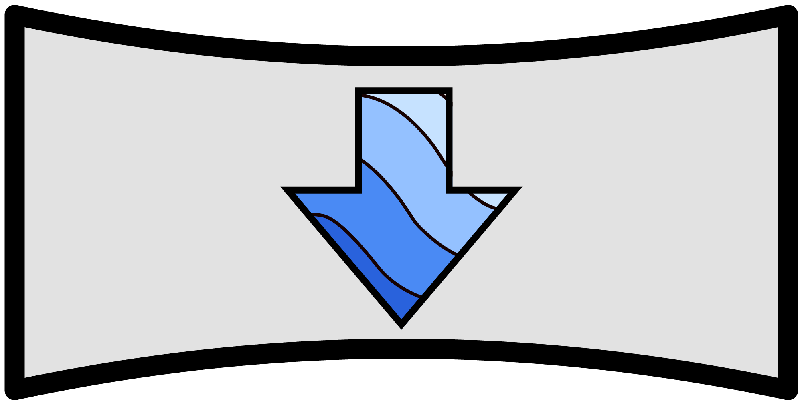

<!-- PROJECT SHIELDS -->
<!--
*** I'm using markdown "reference style" links for readability.
*** Reference links are enclosed in brackets [ ] instead of parentheses ( ).
*** See the bottom of this document for the declaration of the reference variables
*** for contributors-url, forks-url, etc. This is an optional, concise syntax you may use.
*** https://www.markdownguide.org/basic-syntax/#reference-style-links
-->

  
  [![Contributors][contributors-shield]][contributors-url]
  [![Forks][forks-shield]][forks-url]
  [![Stargazers][stars-shield]][stars-url]
  [![Issues][issues-shield]][issues-url]
  [![MIT License][license-shield]][license-url]

<!-- PROJECT LOGO -->
 

 
 
  

  <h1 align="center">Google Earth Panorama Downloader</h1>
  <h3>By JDipi</h3>
  

    A small Tampermonkey script that allows for anyone to download any panorama from Google Street View.
     
    <a href="https://github.com/JDipi/Google-Earth-Pano-Downloader/issues">Report Bug</a>
    ·
    <a href="https://github.com/JDipi/Google-Earth-Pano-Downloader/issues">Request Feature</a>
  

<!-- TABLE OF CONTENTS -->

  
Table of Contents

  <ol>
    <li>
      <a href="#about-the-project">About The Project</a>
      <ul>
        <li><a href="#built-with">Built With</a></li>
      </ul>
    </li>
    <li>
      <a href="#getting-started">Getting Started</a>
      <ul>
        <li><a href="#prerequisites">Prerequisites</a></li>
      </ul>
    </li>
    <li><a href="#usage">Usage</a></li>
    <li><a href="#roadmap">Roadmap</a></li>
    <li><a href="#contributing">Contributing</a></li>
    <li><a href="#license">License</a></li>
    <li><a href="#acknowledgments">Acknowledgments</a></li>
  </ol>

<!-- ABOUT THE PROJECT -->
## About The Project

Easily download Hi-Res panromas provided by users and Google Street View inside Google Earth.

# [Click HERE to install the script!](https://github.com/JDipi/Google-Earth-Pano-Downloader/raw/master/PanoDownloader.user.js)

<!-- USAGE EXAMPLES -->
## Usage

To use the script, simply enter into any street view or photosphere view on Google Earth, then follow the following steps.

#### 1. Click on the "Report a problem" in the footer

#### 2. Press the "Download Pano" botton at the top of the page

#### 3. Simply wait for the download to finish and you're done! 
 - *Check the console for status updates*
 - *The downloading and image processing takes a lot of memory, so if the page becomes temporarily unresponsive or hangs, don't be scared!*
 - *Processing could take up to 2 minutes depending on your internet connection and the images resolution.*
   - *Downloading a photosphere tends to take less time than a street view location because the stitching step is skipped.*

(<a href="#readme-top">back to top</a>)

## Built With
Here are the libraries I used for this project.

* [![JQuery][JQuery.com]][JQuery-url]
* [![jszip][jszip]][jszip-url]
* [![filesaver][filesaver]][filesaver-url]
* [![merge-images][mergeimages]][mergeimages-url]

(<a href="#readme-top">back to top</a>)

<!-- GETTING STARTED -->
## Getting Started

To get started downloading panoramas you will need to have the browser extension **Tampermonkey**. Once installed in your preffered browser simply click the install at the top of this page. 

### Prerequisites

1. Select the browser you use from the options on the top.
2. Select "Download" for Tampermonkey, **NOT** Tampermonkey Beta.
3. Finish installing the extension on the new page.
#### [Install Tampermonkey Here](https://www.tampermonkey.net/)

If you have any trouble with installation, refer to the video below.

*[How to Install Tampermonkey](https://www.youtube.com/watch?v=kjeERqWY04s)*

<!-- ROADMAP -->
## Roadmap

- [ ] Make loading progress show on page instead of in console.
- [ ] Remove the 'report a problem' process for a straighforward button elsewhere.
- [ ] Add options to specify download quality and file name
- [ ] Allow user to download depth maps

See the [open issues](https://github.com/JDipi/Google-Earth-Pano-Downloader/issues) (there may be none) for a full list of proposed features and known issues.

(<a href="#readme-top">back to top</a>)

<!-- CONTRIBUTING -->
## Contributing

If you have a suggestion that would make this better, please fork the repo and create a pull request. You can also simply open an issue with the tag "enhancement".
Don't forget to give the project a star! Thanks again!

1. Fork the Project
2. Create your Feature Branch (`git checkout -b feature/NewFeature`)
3. Commit your Changes (`git commit -m 'Add some NewFeature'`)
4. Push to the Branch (`git push origin feature/NewFeature`)
5. Open a Pull Request

(<a href="#readme-top">back to top</a>)

<!-- LICENSE -->
## License

Distributed under the MIT License. See `LICENSE` for more information.

(<a href="#readme-top">back to top</a>)

<!-- ACKNOWLEDGMENTS -->
## Acknowledgments

* [Img Shields](https://shields.io)
* [Paper on 3D City Reconstruction by Marco Cavallo](https://creativecoding.soe.ucsc.edu/courses/cs526/papers/Cavallo_3DCityReconstruction2015.pdf)

(<a href="#readme-top">back to top</a>)

<!-- MARKDOWN LINKS & IMAGES -->
<!-- https://www.markdownguide.org/basic-syntax/#reference-style-links -->
[contributors-shield]: https://img.shields.io/github/contributors/JDipi/Google-Earth-Pano-Downloader.svg?style=for-the-badge
[contributors-url]: https://github.com/JDipi/Google-Earth-Pano-Downloader/graphs/contributors
[forks-shield]: https://img.shields.io/github/forks/JDipi/Google-Earth-Pano-Downloader.svg?style=for-the-badge
[forks-url]: https://github.com/JDipi/Google-Earth-Pano-Downloader/network/members
[stars-shield]: https://img.shields.io/github/stars/JDipi/Google-Earth-Pano-Downloader.svg?style=for-the-badge
[stars-url]: https://github.com/JDipi/Google-Earth-Pano-Downloader/stargazers
[issues-shield]: https://img.shields.io/github/issues/JDipi/Google-Earth-Pano-Downloader.svg?style=for-the-badge
[issues-url]: https://github.com/JDipi/Google-Earth-Pano-Downloader/issues
[license-shield]: https://img.shields.io/github/license/JDipi/Google-Earth-Pano-Downloader.svg?style=for-the-badge
[license-url]: https://github.com/JDipi/Google-Earth-Pano-Downloader/blob/master/LICENSE.txt
[JQuery.com]: https://img.shields.io/badge/jQuery-0769AD?style=for-the-badge&logo=jquery&logoColor=white
[JQuery-url]: https://jquery.com 
[filesaver]: https://img.shields.io/badge/file--saver.js-88B3FA?style=for-the-badge&logoColor=white
[filesaver-url]: https://github.com/eligrey/FileSaver.js
[jsZip]: https://img.shields.io/badge/jszip-5BAAD9?style=for-the-badge&logoColor=white
[jsZip-url]: https://stuk.github.io/jszip/
[mergeimages]: https://img.shields.io/badge/merge--images-71F0F0?style=for-the-badge&logoColor=white
[mergeimages-url]: https://github.com/lukechilds/merge-images
